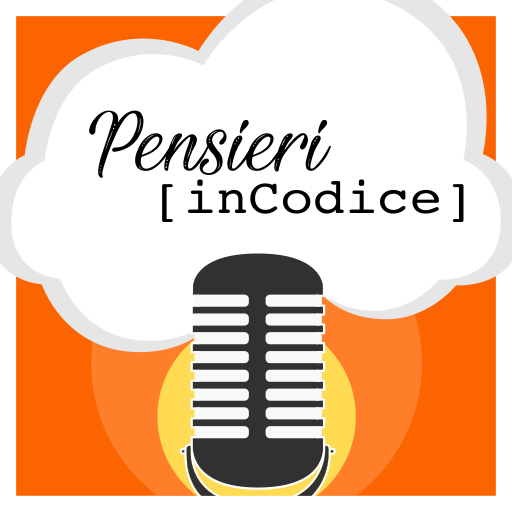

<div align="center">
  
  <h1>Pensieri in codice — Website</h1>
  <p>Sito web del podcast, costruito con Hugo.</p>
  <p>
    
    <a href="https://pensieriincodice.it/sostieni" target="_blank" rel="noopener noreferrer">
      
    </a>
  </p>
</div>

---

## Come funziona

Il sito è generato staticamente tramite [Hugo](https://gohugo.io/). I contenuti (episodi, pagine, post) vengono scritti in Markdown e compilati in HTML statico pronto per il deploy.

---

## Requisiti

- [Hugo](https://gohugo.io/installation/) (versione extended consigliata)

---

## Installazione e avvio

```bash
# Avvia il server locale con hot reload
hugo server

# Build per produzione
hugo
```

---

## Repository correlate

- [pensieriincodice-cdn](https://github.com/valeriogalano/pensieriincodice-cdn) — Asset pubblicati via CDN (episodi, cover, trascrizioni)
- [pensieriincodice-assets](https://github.com/valeriogalano/pensieriincodice-assets) — Sorgenti degli asset

---

## Contributi

Se noti qualche problema o hai suggerimenti, sentiti libero di aprire una **Issue** e successivamente una **Pull Request**. Ogni contributo è ben accetto!

---

## Importante

Vorremmo mantenere questo repository aperto e gratuito per tutti, ma lo scraping del contenuto di questo repository **NON È CONSENTITO**. Se ritieni che questo lavoro ti sia utile e vuoi utilizzare qualche risorsa, ti preghiamo di citare come fonte il podcast e/o questo repository.
